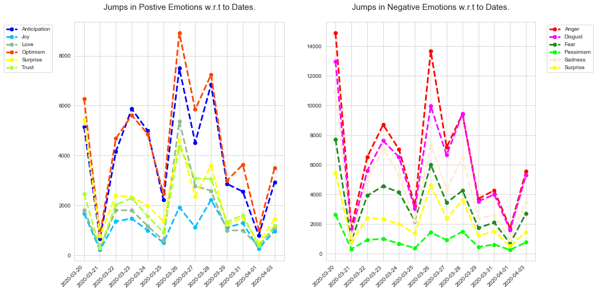

# COVID-19 Tweets Analysis Multi-label Sentiment Classification

### Abstract

Though Twitter sentiment analysis modulations are rife in the current
age of Deep Learning, there is little focus on the existence of multiple
emotions in tweets as it presents itself as a taxing task due to a
prevalent inability in identifying inter-label dependencies and
correlations. The presence of one emotion entails a highly likely
occurrence of another in the same subset, yet is usually disregarded
when attempting sentiment analysis of tweets in order to focus primarily
on singular labels. If explored concretely, it is liable to open up
exploitation of why the existence of one emotion implies the existence
of another, and how they can be utilized together to better approach
emotion-based openings. The aim of this project is to utilize
sentiment-relevant frameworks such as Bag-of-Words (BOW) and
Bidirectional Encoder Representation from Transformers (BERT), alongside
sequential networks such as Long Short-Term Memory (LSTM) to identify
these multiple labels at higher rates of efficiency than those provided
by usual attempts of most modular methods. Through our attempt, we will
also analyze the identifiers that trigger each emotion, such as month
frequency and location-based clusters. The aim of this research is to
recognize and analyze the emotions of tweets relevant to COVID-19, in
order to provide beneficial value to prospective stakeholders in making
decisions with regard to the virus, general health and well-being. We
were able to achieve an accuracy rate of 82% and 87% respectively with
optimal individual loss functionalities for the task using a BERT-base
uncased model tuned to certain parameter settings.

### Dataset

Two datasets have been used for this research purpose
- Dataset-1 ->
  [CORONAVIRUS (COVID-19) TWEETS DATASET](https://ieee-dataport.org/open-access/coronavirus-covid-19-tweets-dataset)

- Dataset-2 ->
  [Sem Eval Task 1 Dataset](http://saifmohammad.com/WebDocs/AIT-2018/AIT2018-DATA/SemEval2018-Task1-all-data.zip)

Dataset-1 Tweets-ID has been published, related to Covid 19, filtered on
hashtags like “corona”, "coronavirus", "covid", "pandemic", "lockdown",
"quarantine", "hand sanitizer", "ppe", "n95", different possible
variants of "sarscov2", "nCov", "covid-19", "ncov2019", "2019ncov",
"flatten(ing) the curve", "social distancing", "work(ing) from home" and
the respective hashtag of all these keywords.

Tweets were downloaded using [TweetScrappingScript](Codes/TweetScrappingScript.R), users' location
using [User Data](Codes/Twitter%20User%20Data%20Downloading.ipynb) and merged with dataset using [Location Merger](Codes/Location%20Merger.R) and text pre-processed using [Tweet Text Pre-Processor](Codes/Tweet%20Text%20Pre-Processor.ipynb)

- Dataset-1 Attributes:

    | tweet_id           | user_id        | date          | time     | is_qoute | text    |
    |:-------------------|:---------------|:--------------|:---------|:---------|:--------|
    | display_text_width | favorite_count | retweet_count | hashtags | lang     | symbols |
    | location           | lat            | long          | location | lat      | long    |

    Table 1: Dataset-1 Attributes

- Dataset-2 Attributes:

    | ID       | text           |
    |:---------|:---------------|

    Table 2: Dataset-1 Attributes

Dataset-1 was divided into two part one for training/testing and second for labeling by trained models (24185 Tweet samples). Sized of Datasets used for training and testing the models are as below:

| Dataset size | Train | Validate | Test |
|:-------------|:------|:---------|:-----|
| Dataset-1    | 4937  | 1064     | 1085 |
| Dataset-2    | 6938  | 886      | 3259 |

Table 3: Datasets split sizes

Dataset-1 and dataset-2 Labeled and Predicting Emotions for both datasets are as below:

| anger   | disgust  | anticipation | fear      |
|:--------|:---------|:-------------|:----------|
| joy     | optimism | love         | pessimism |
| sadness | trust    | surprise     | trust     |

Table 4: Labeled and Predicting Emotions

After training and testing our models usded
[LabelingDataset](https://drive.google.com/file/d/15zxJxv2vvw0aPIn7YkeTddABrX0htadZ/view?usp=sharing)
to classify the emotions of the Tweets.

You can find the complete dataset used for this research purpose
[here](https://drive.google.com/drive/folders/1WLDUF-SOPVk6RwuhqgR2XRwnbrWng8mo?usp=sharing)

### Models

Three different models were used
- Bag of Word (BOW)
- Long Short Term Memory (LSTM)
- Bidirectional Encoder Decoder Transformer (BERT)

For this research BERT 'bert-based-uncased' model was used.

##### Pre-tranied Models

To reproduce resulst, find the pre-trained models for this project
[here](https://drive.google.com/drive/folders/1ySF7HwnQz00Zju1Hma94jdkacuInTMge?usp=sharing).

### Results

All of our model implementations were attempted with both sets of data
for comparative and performance evaluation purposes. The BOW model was
implemented using ‘PyTorch,’ the LSTM model was implemented using
‘Keras,’ while the BERT model was implemented in ‘TensorFlow’ (in which
it performed too slow) and PyTorch (in which it performed faster) both.

|      | Jaccard Index | Precision | Recall | F1 Score | BECWithLogitsLoss | Accuracy |
|:-----|:--------------|:----------|:-------|:---------|:------------------|:---------|
| BOW  | 0.109         | 0.166     | 0.063  | 0.092    | 0.65              | 0.176    |
| LSTM | 0.121         | 0.152     | 0.205  | 0.175    | 0.443             | 0.548    |
| BERT | 0.379         | 0.166     | 0.391  | 0.526    | 0.70              | 0.873    |

Table 5: Results of Evaluation Metrics for our implementations on our COVID-19 Tweets Dataset

|      | Jaccard Index | Precision | Recall | F1 Score | Focal Loss | Accuracy |
|:-----|:--------------|:----------|:-------|:---------|:-----------|:---------|
| BOW  | 0.430         | 0.584     | 0.538  | 0.092    | 0.655      | 0.146    |
| LSTM | 0.367         | 0.403     | 0.591  | 0.175    | 0.630      | 0.679    |
| BERT | 0.370         | 0.806     | 0.391  | 0.526    | 0.413      | 0.828    |

Table 6: Results of Evaluation Metrics for our implementations on the SemEval – Task 1 Dataset

| LSTM                                     | BOW                                     | BERT                                     |
|:-----------------------------------------|:----------------------------------------|:-----------------------------------------|
|  |  |  |

Table 7: Classification Report for our implementations on the SemEval – Task 1 Dataset

### Tweets Emotional Analysis

Figure 1: Frequent locating regions that appear to directly affect the predicted emotions.

Figure 2: Correlation Matrix of the Predicted Emotion Labels from the BERT model.

Figure 3: Occurrence of Emotion Labels in the BERT model.

Figure 4: Top 10 Word Occurrences in the tweets of the COVID-19 Tweets Dataset.

Figure 5: Comparison of Iran and Pakistan with respect to each emotion and event of date present in the COVID-19 Tweets Dataset

Figure 6a: Comparison of each emotion overall relevant to dates present in the COVID-19 Tweets Dataset

Figure 6b: Interpolated comparison of each emotion overall relevant to dates present in the COVID-19 Tweets Dataset.

Figure 7: Comparison of each positive emotion with each negative emotion relevant to dates present in the COVID-19 Tweets Dataset

Figure 8: A fragment of the World Map depicting clusters of emotions with intensity

For further details, please read the project [Report](Report/G1H_report_COVID-19%20Tweets%20Analysis.pdf)